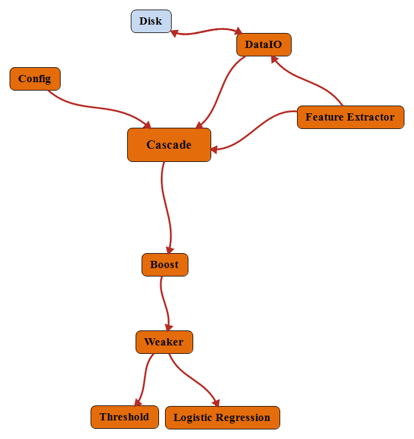

# Cascade-Parallel

本项目基于MPI实现分布式级联分类器，分类器的每一层为Adaboost，每一层Adaboost支持单结点决策树以及单变量逻辑回归作为弱分类器。能够利用任意指定的算法对图像进行特征提取并训练分类器，可用于特征的自动选择和图像分类。
项目文档见[documentation.chm](./doc/documentation.chm)，结构图如下图所示



## 依赖库

* MSMPI

* Eigen

* tinyxml2

* OpenCV


## 使用

### 参数说明

[config.xml]()

* maxlayers： 级联分类器最大层数

* neg_live: 负样本最大连续存活层数

* max_weaker: 每层分类器最大弱分类器个数

* img_width: 特征提取函数输入图像宽度

* img_height: 特征提取函数输入图像高度

* stepX: 特征提取函数水平移动步长

* stepY: 特征提取函数竖直移动步长

* startlayer: 训练开始层数

* type: 弱分类器种类

* hit_rate: 每层Boost分类器的最小召回率

* false_rate: 每层Boost分类器的最大假正类率


[weaker_parameters.xml]()

* need_sort: 特征是否需要排序

* need_normalize: 特征是否需要归一化

* learning_rate: 学习率

* weight_decay: l2正则化系数

* batch_size: 随机梯度下降batch size

* max_iter: 最大迭代步数


[path.xml]()

* posList: 正样本路径

* negList: 负样本路径

* bakList: 困难样本路径


[features.xml]()

* fucnNum: 特征提取函数个数

* featNum: 特征总维度

* path: 特征提取函数dll路径

* featNum: 单个特征提取函数特征维度


### 特征提取函数

为兼容本项目原始C语言版本，特征提取函数接口定义如下
``` cpp
int process(void* param, void* img, FeatureResult* result);
```
其中，param为特征提取函数参数，目前程序传入NULL; img为图像，程序传入cv::Mat; FeatureResult为结果结构体。
编写特征提取算法dll，需定义如上形式和名称的接口。


